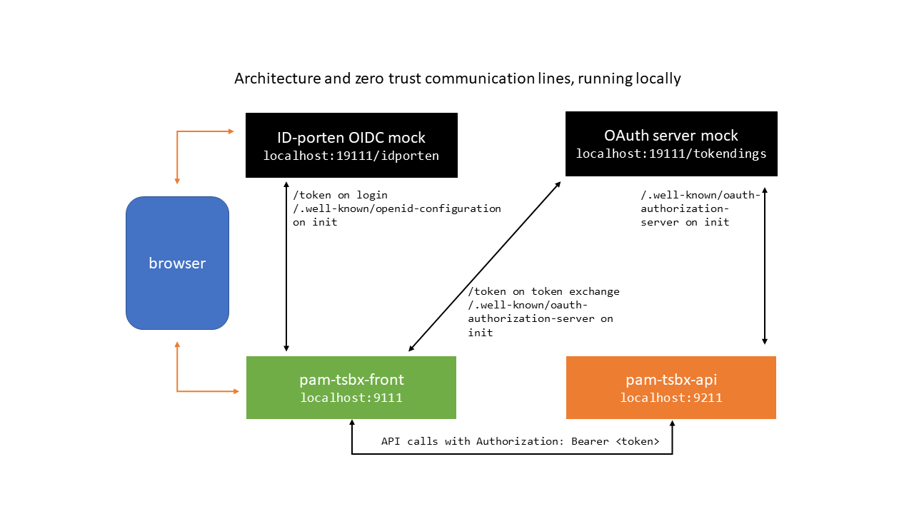

# Token sandbox: front application with OpenID-connect integration (ID-porten)

This is a demo app which implements OIDC authorization code flow login with
ID-porten on the [nais][1] platform. It runs on the JVM and uses Spring Boot and
[Nimbus OAuth2 SDK][2] directly for OIDC. The purpose of this app is
experimentation and *learning*, but it aims to implement all security
requirements correctly.

Together with its API component [`pam-tsbx-api`][3], it becomes a demo of a
simple zero trust architecture, where OAuth token exchange is used to
communicate with the API component on behalf of the logged in end user. For
OAuth token exchange, the [`token-support`][4] project is used, more
specifically its `token-client-spring` component.

[1]: https://nais.io/
[2]: https://connect2id.com/products/nimbus-oauth-openid-connect-sdk
[3]: https://github.com/navikt/pam-tsbx-api
[4]: https://github.com/navikt/token-support#token-client-spring

The main login flow of the app can be traced from the [`AuthController`][5]
class and other classes in the same package. The app logs http accesses so that
you can observe the authentication flow in the logs.

[5]: src/main/java/no/nav/arbeid/tsbx/auth/AuthController.java

The `messages` package contains REST client code to obtain user messages from
the remote API component `pam-tsbx-api`.

## Running locally

Java 17+ and Maven is required. Then just:

    mvn -Pdev
    
### Or start app directly from IntelliJ

Run as Spring Boot application with `DevApplication` as main class.

### Local OAuth2 server

An OAuth2 server is required to run alongside the application locally. When
using either of the the above two methods to start app, an embedded mock OAuth2
server is automatically started on port `19111`, if something isn't already
listening on that port.
    
### Access app

To trigger an OIDC login flow, open your browser at:

http://localhost:9111/

Click the login link. You should be immediately redirected to a login page on
the mock oauth server running on port 19111. For a successful login to occur,
input a name, whatever you like, and include these additional claims on the
login page:

```json
{"acr": "Level3", "pid": "01234567890"}
```

They are required and validated by the app, so login will fail without this
extra input. The `pid` claim can be any 11 digit number. After successfully
logging in, you will be returned to the front page. There you should see
username and pid claim, and a link to see all id-token claims.

You may notice on the front page that no personalized messages could be fetched
from pam-tsbx-api. For this, see next chapter.


### Running local API component pam-tsbx-api as well

Open project [`pam-tsbx-api`][6] and start it according to its
[README][7]:

    mvn -Pdev
    
[6]: https://github.com/navikt/pam-tsbx-api
[7]: https://github.com/navikt/pam-tsbx-api#running-this-api-locally
    
Reload front page and login if you haven't already. `pam-tsbx-front` will fetch
user messages from the API using a token obtained through token exchange using
the OAuth authorization server.

In this case, the mock oauth server acts as both ID-porten OIDC identity provider,
and an OAuth2 token exchange server.


## Tests

Integration test [`AuthControllerIT`][8] tests the entire login flow using a
temporary mock OAuth2 server instance.

[8]: src/test/java/no/nav/arbeid/tsbx/auth/AuthControllerIT.java


## Session storage

Session storage is required for proper authentication flow between the app and
the authorization server. The app does not use external session storage and only
works when running as a single pod on Kubernetes/nais.

## Architecture and zero trust communication lines


